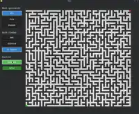
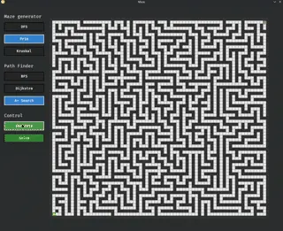
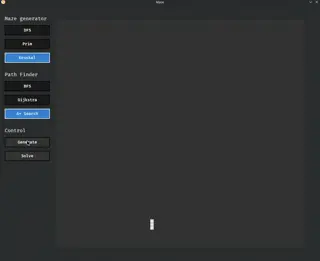
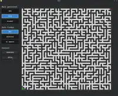
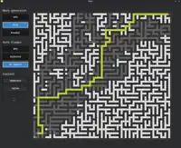
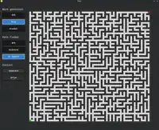

# Bevy Maze Visualizer


An interactive maze generation and pathfinding visualizer built with **Rust** and the **Bevy Engine**.

This project uses Bevy's ECS (Entity Component System), State Machines, Observers, and dynamically decoupled Resources to manage algorithm visualizations.

## ✨ Features

* **Interactive UI Panel:** Easily switch between different algorithms and control the execution flow (Generate / Solve) via an integrated side panel.
* **Dynamic Resolution:** The maze automatically calculates its optimal Tile Size and offsets to perfectly fit your screen, alongside the UI panel.
* **Decoupled Architecture:** Algorithms run cleanly in their own `State` and `Resource` environments, preventing data leaks and ensuring flawless repeatability.
* **Animated Visualization:** Watch algorithms unfold step-by-step.

### 🏗️ Supported Algorithms

**Maze Generation:**
* **DFS (Backtracker):** Creates deep, winding mazes with long corridors.
* **Prim's Algorithm:** Generates organic mazes with many short dead-ends and branching paths.
* **Kruskal's Algorithm:** Uses a Disjoint-Set (Union-Find) data structure to create highly uniform, fractal-like mazes.

**Pathfinding:**
* **BFS (Breadth-First Search):** Explores equally in all directions. Guarantees the shortest path in unweighted grids.
* **Dijkstra's Algorithm:** The foundation of weighted pathfinding. (Currently visually similar to BFS since all path weights are 1).
* **A\* (A-Star) Search:** Uses Manhattan distance heuristics to aggressively target the destination, making it the most efficient solver.

#### Examples

<table>
    <tr>
        <td>
        <figure>
          
          <figcaption align="center">DFS</figcaption>
        </figure>
        </td>
        <td>
        <figure>
          
          <figcaption align="center">Prim's Algorithm</figcaption>
        </figure>
        </td>
        <td>
        <figure>
          
          <figcaption align="center">Kruskal's Algorithm</figcaption>
        </figure>
        </td>
    </tr>
    <tr>
        <td>
        <figure>
          
          <figcaption align="center">BFS</figcaption>
        </figure>
        </td>
        <td>
        <figure>
          
          <figcaption align="center">Dijkstra</figcaption>
        </figure>
        </td>
        <td>
        <figure>
          
          <figcaption align="center">A*</figcaption>
        </figure>
        </td>
    </tr>
</table>

## 🚀 Getting Started

### Prerequisites
Make sure you have [Rust and Cargo](https://rustup.rs/) installed.

### Running the Project

To compile and run the project normally:

```bash
cargo run --release
```
### 🛠️ Development Mode (Fast Compiles)

If you are developing or tinkering with the code, it is highly recommended to use the dev feature. This enables Bevy's dynamic linking, which drastically reduces iterative compile times from minutes to seconds.

```Bash
cargo run --features dev
```

Note: If you encounter shared library errors like cannot open shared object(such as libbevy_dylib-* and libstd-*) file in your IDE, ensure you have set LD_LIBRARY_PATH=(rustc --print sysroot)/lib:target/debug/deps.

## 🎮 Usage

1. Launch the app: You will see a blank grid (all walls) and a control panel on the left.

2. Select a Generator: Click on DFS, Prim, or Kruskal under the "Maze Generator" section.

3. Generate Maze: Click the Generate button. Watch the maze carve itself out.

4. Select a Solver: Once generation is complete, click on BFS, Dijkstra, or A* under "Path Finder".

5. Solve: Click the Solve button. Watch the algorithm search for the endpoint. Once found, the shortest path will be traced in gold.

6. Repeat: You can immediately select a different solver and hit Solve again to race algorithms on the same maze, or hit Generate to wipe the board and start fresh!

## 📂 Project Structure

+ core.rs: Contains the core ECS components, global States (AppState), and shared resources.

+ ui.rs: Manages the Bevy UI layout, radio button interactions, and the Observer system that updates Tile colors efficiently.

+ generation.rs: Contains the maze generation algorithms, isolated by their own Bevy Resources.

+ pathfinding.rs: Contains the solving algorithms. Features a unified PathTracker to handle the shortest-path backtracking animation gracefully.

## 📄 License

This project is licensed under MIT License (LICENSE-MIT or http://opensource.org/licenses/MIT)

## 🙏 Credits

A huge thank you to the tools, teams, and technologies:

+ [Rust Language](https://rust-lang.org/)

+ [Bevy Engine](https://bevy.org/)

+ [RustRover](https://www.jetbrains.com/rust/)

+ [Google Gemini](https://gemini.google.com/)